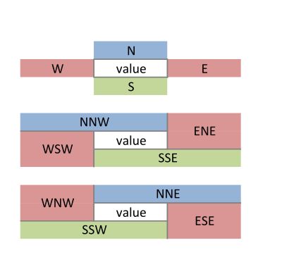
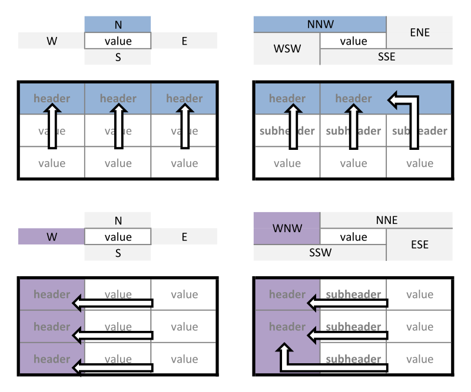

<!-- README.md is generated from README.Rmd. Please edit that file -->

```{r, include = FALSE}
knitr::opts_chunk$set(
  collapse = TRUE,
  comment = "#>",
  fig.path = "README-"
)
```

# unpivotr

[](https://travis-ci.org/nacnudus/unpivotr)
[](https://ci.appveyor.com/project/nacnudus/unpivotr)
[](https://codecov.io/gh/nacnudus/unpivotr)


[unpivotr](https://github.com/nacnudus/unpivotr) provides tools for converting
data from complex or irregular layouts to a columnar structure.  For example,
tables with multi-level column or row headers, or spreadsheets.  Header and data
cells are selected by their contents, position and formatting, and are
associated with one other by their relative positions.

Excel (.xlsx) files can be prepared for
[unpivotr](https://github.com/nacnudus/unpivotr) the
[tidyxl](https://github.com/nacnudus/tidyxl) package.

## Installation

```{r, echo = TRUE, eval = FALSE}
devtools::install_github("nacnudus/tidyxl", build_vignettes = TRUE)
```

There are several dependencies:

* data.table (>= 1.9.7)
* dplyr
* dtplyr
* purrr
* tidyr

## Example

The package includes a dataset, `purpose`, which is a list of pivot tables,
derived from a survey by Statistics New Zealand of people's sense-of-purpose.  A
'tidy' version of the data is also included.

```{r, echo = TRUE}
library(unpivotr)
head(purpose$Tidy) # 'Tidy' version of the data
(pivoted <- purpose$`NNW WNW`) # The same data, pivoted
```

To unpivot this table, first get a tabular representation of each cell, its
value and its position in the original pivot table.

```{r, echo = TRUE}
cells <- tidytable(pivoted, colnames = FALSE)
cells <- cells[!is.na(cells$character), ]
head(cells)
```

This can easily be subset for header and data cells.

```{r, echo = TRUE}
library(dplyr)
# Select the cells containing the values
datacells <- 
  cells %>%
  filter(row >= 3, col >= 3)
head(datacells)

# Select the row headers
row_headers <- 
  cells %>%
  filter(col <= 2) %>%
  select(row, col, header = character) %>%
  split(.$col) # Separate each column of headers
lapply(row_headers, head)

# Select the column headers
col_headers <- 
  cells %>%
  filter(row <= 2) %>%
  select(row, col, header = character) %>%
  split(.$row) # Separate each row of headers
col_headers
```

Using [unpivotr](https://github.com/nacnudus/unpivotr) functions, we associate
the data cells with the headers, by proximity in given compass directions.

```{r, echo = TRUE}
# From each data cell, search for the nearest one of each of the headers
unpivoted <- 
  datacells %>%
  NNW(col_headers$`1`) %>% # Search north (up) and north-west (up-left)
  N(col_headers$`2`) %>% # Search directly north (up)
  WNW(row_headers$`1`) %>% # Search west (left) and north-west
  W(row_headers$`2`) # Search directly left (west)
unpivoted
```

We can re-pivot the final data in R using `ftable()` to check that it has been
imported correctly.

```{r, echo = TRUE}
ftable(unpivoted[7:10], 
       row.vars = 3:4,
       col.vars = 1:2)
```

## Compass directions

The concept of compass directions is compactly expressed by this triptych.



The most useful ones are more fully explained here.



A complete explanation is in 'poster' form
[here](./inst/extdata/compass-complete.svg).

## Philosophy

Information in in many spreadsheets cannot be easily imported into R.  Why?

Most R packages that import spreadsheets have difficulty unless the layout of
the spreadsheet conforms to a strict definition of a 'table', e.g.:

* observations in rows
* variables in columns
* a single header row
* all information represented by characters, whether textual, logical, or
  numeric

These rules are designed to eliminate ambiguity in the interpretation of the
information.  But most spreadsheeting software relaxes these rules in a trade of
ambiguity for expression via other media:

* proximity (other than headers, i.e. other than being the first value at the
  top of a column)
* formatting (colours and borders)

Humans can usually resolve the ambiguities with contextual knowledge, but
computers are limited by their ignorance.  Programmers are hampered by:

* their language's expressiveness
* loss of information in transfer from spreadsheet to programming library

Information is lost when software discards it in order to force the data into
tabular form.  Sometimes date formatting is retained, but mostly formatting 
and comments are lost, and position has to be inferred.

## Similar projects

[unpivotr](https://github.com/nacnudus/unpivotr) is inspired by the United
Kingdom Office of National Statistics
[ONSdatabaker](https://github.com/ONS-OpenData/ONSdatabaker), which is
implemented in Python.  [unpivotr](https://github.com/nacnudus/unpivotr) differs
already by using compass directions and searching for headers between
boundaries.

The [rsheets](https://github.com/rsheets) project of several R packages is in
the early stages of importing spreadsheet information from Excel and Google
Sheets into R, manipulating it, and potentially parsing and processing formulas
and writing out to spreadsheet files.  In particular,
[jailbreaker](https://github.com/rsheets/jailbreakr) attempts to extract
non-tabular data from spreadsheets into tabular structures automatically via
some clever algorithms.

[unpivotr](https://github.com/nacnudus/unpivotr) differs from
[jailbreaker](https://github.com/rsheets/jailbreakr) in that it provides tools
for unpivoting complex and non-tabular data layouts using I not AI
(intelligence, not artificial intelligence).

## Roadmap

As common unpivoting idioms emerge, they will be generalised and added to the
package. E.g. combining long header titles that are spelled out across cells,
rather than being in one cell merged across others.
