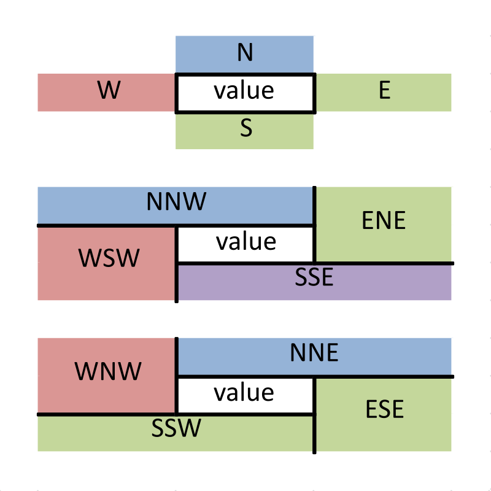

<!-- README.md is generated from README.Rmd. Please edit that file -->
unpivotr
========

[](https://travis-ci.org/nacnudus/unpivotr) [](https://ci.appveyor.com/project/nacnudus/unpivotr) [](https://cran.r-project.org/web/packages/unpivotr/index.html) [](https://www.r-pkg.org/pkg/unpivotr) [](https://codecov.io/gh/nacnudus/unpivotr)

[unpivotr](https://github.com/nacnudus/unpivotr) provides tools for converting data from complex or irregular layouts to a columnar structure. For example, tables with multi-level column or row headers, or spreadsheets. Header and data cells are selected by their contents, position and formatting, and are associated with one other by their relative positions.

Excel (.xlsx) files can be prepared for [unpivotr](https://github.com/nacnudus/unpivotr) via the [tidyxl](https://github.com/nacnudus/tidyxl) package.

Mailing list
------------

For bugs and/or issues, create a new issue on [GitHub](https://github.com/nacnudus/tidyxl/issues) For other questions or comments, please subscribe to the [tidyxl-devel mailing list](https://groups.google.com/forum/#!forum/tidyxl-devel). You must be a member to post messages, but anyone can read the archived discussions.

Installation
------------

``` r
devtools::install_github("nacnudus/unpivotr", build_vignettes = TRUE)
```

There are several dependencies:

-   data.table (&gt;= 1.9.7)
-   dplyr
-   dtplyr
-   purrr
-   tidyr

Example
-------

The package includes a dataset, `purpose`, which is a list of pivot tables, derived from a survey by Statistics New Zealand of people's sense-of-purpose. A 'tidy' version of the data is also included.

``` r
library(unpivotr)
#> 
#> Attaching package: 'unpivotr'
#> The following object is masked from 'package:stats':
#> 
#>     offset
head(purpose$Tidy) # 'Tidy' version of the data
#>    Sex Age group (Life-stages) Highest qualification Sense of purpose
#> 1 Male                 15 - 24      No Qualification            0 - 6
#> 2 Male                 15 - 24      No Qualification           7 - 10
#> 3 Male                 15 - 24           Certificate            0 - 6
#> 4 Male                 15 - 24           Certificate           7 - 10
#> 5 Male                 15 - 24               Diploma            0 - 6
#> 6 Male                 15 - 24               Diploma           7 - 10
#>    Value Flags
#> 1  12000  <NA>
#> 2  37000  <NA>
#> 3  30000  <NA>
#> 4 190000  <NA>
#> 5   9000     *
#> 6  11000     *
(pivoted <- purpose$`NNW WNW`) # The same data, pivoted
#>                            X2      X3     X4     X5    X6     X7
#> 1                        <NA>    <NA> Female   <NA>  Male   <NA>
#> 2                        <NA>    <NA>  0 - 6 7 - 10 0 - 6 7 - 10
#> 3           Bachelor's degree 15 - 24   7000  27000  <NA>  13000
#> 4                        <NA> 25 - 44  12000 137000  9000  81000
#> 5                        <NA> 45 - 64  10000  64000  7000  66000
#> 6                        <NA>     65+   <NA>  18000  7000  17000
#> 7                 Certificate 15 - 24  29000 161000 30000 190000
#> 8                        <NA> 25 - 44  34000 179000 31000 219000
#> 9                        <NA> 45 - 64  30000 210000 23000 199000
#> 10                       <NA>     65+  12000  77000  8000 107000
#> 11                    Diploma 15 - 24   <NA>  14000  9000  11000
#> 12                       <NA> 25 - 44  10000  66000  8000  47000
#> 13                       <NA> 45 - 64   6000  68000  5000  58000
#> 14                       <NA>     65+   5000  41000  1000  34000
#> 15           No Qualification 15 - 24  10000  43000 12000  37000
#> 16                       <NA> 25 - 44  11000  36000 21000  50000
#> 17                       <NA> 45 - 64  19000  91000 17000  75000
#> 18                       <NA>     65+  16000 118000  9000  66000
#> 19 Postgraduate qualification 15 - 24   <NA>   6000  <NA>   <NA>
#> 20                       <NA> 25 - 44   5000  86000  7000  60000
#> 21                       <NA> 45 - 64   6000  55000  6000  68000
#> 22                       <NA>     65+   <NA>  13000  <NA>  18000
```

To unpivot this table, first get a tabular representation of each cell, its value and its position in the original pivot table.

``` r
cells <- tidytable(pivoted, colnames = FALSE)
cells <- cells[!is.na(cells$character), ]
head(cells)
#>    row col                  character double integer logical
#> 3    3   1          Bachelor's degree     NA      NA      NA
#> 7    7   1                Certificate     NA      NA      NA
#> 11  11   1                    Diploma     NA      NA      NA
#> 15  15   1           No Qualification     NA      NA      NA
#> 19  19   1 Postgraduate qualification     NA      NA      NA
#> 25   3   2                    15 - 24     NA      NA      NA
```

This can easily be subset for header and data cells.

``` r
library(dplyr)
#> 
#> Attaching package: 'dplyr'
#> The following objects are masked from 'package:stats':
#> 
#>     filter, lag
#> The following objects are masked from 'package:base':
#> 
#>     intersect, setdiff, setequal, union
# Select the cells containing the values
datacells <-
  cells %>%
  filter(row >= 3, col >= 3)
head(datacells)
#>   row col character double integer logical
#> 1   3   3      7000     NA      NA      NA
#> 2   4   3     12000     NA      NA      NA
#> 3   5   3     10000     NA      NA      NA
#> 4   7   3     29000     NA      NA      NA
#> 5   8   3     34000     NA      NA      NA
#> 6   9   3     30000     NA      NA      NA

# Select the row headers
row_headers <-
  cells %>%
  filter(col <= 2) %>%
  select(row, col, header = character) %>%
  split(.$col) # Separate each column of headers
lapply(row_headers, head)
#> $`1`
#>   row col                     header
#> 1   3   1          Bachelor's degree
#> 2   7   1                Certificate
#> 3  11   1                    Diploma
#> 4  15   1           No Qualification
#> 5  19   1 Postgraduate qualification
#> 
#> $`2`
#>    row col  header
#> 6    3   2 15 - 24
#> 7    4   2 25 - 44
#> 8    5   2 45 - 64
#> 9    6   2     65+
#> 10   7   2 15 - 24
#> 11   8   2 25 - 44

# Select the column headers
col_headers <-
  cells %>%
  filter(row <= 2) %>%
  select(row, col, header = character) %>%
  split(.$row) # Separate each row of headers
col_headers
#> $`1`
#>   row col header
#> 1   1   3 Female
#> 4   1   5   Male
#> 
#> $`2`
#>   row col header
#> 2   2   3  0 - 6
#> 3   2   4 7 - 10
#> 5   2   5  0 - 6
#> 6   2   6 7 - 10
```

Using [unpivotr](https://github.com/nacnudus/unpivotr) functions, we associate the data cells with the headers, by proximity in given compass directions.

``` r
# From each data cell, search for the nearest one of each of the headers
unpivoted <-
  datacells %>%
  NNW(col_headers$`1`) %>% # Search north (up) and north-west (up-left)
  N(col_headers$`2`) %>% # Search directly north (up)
  WNW(row_headers$`1`) %>% # Search west (left) and north-west
  W(row_headers$`2`) # Search directly left (west)
unpivoted
#> # A tibble: 72 × 10
#>      row   col character double integer logical header.data header.header
#>    <int> <int>     <chr>  <dbl>   <int>   <lgl>       <chr>         <chr>
#> 1      3     3      7000     NA      NA      NA      Female         0 - 6
#> 2      4     3     12000     NA      NA      NA      Female         0 - 6
#> 3      5     3     10000     NA      NA      NA      Female         0 - 6
#> 4      7     3     29000     NA      NA      NA      Female         0 - 6
#> 5      8     3     34000     NA      NA      NA      Female         0 - 6
#> 6      9     3     30000     NA      NA      NA      Female         0 - 6
#> 7     10     3     12000     NA      NA      NA      Female         0 - 6
#> 8     12     3     10000     NA      NA      NA      Female         0 - 6
#> 9     13     3      6000     NA      NA      NA      Female         0 - 6
#> 10    14     3      5000     NA      NA      NA      Female         0 - 6
#> # ... with 62 more rows, and 2 more variables: header.data.data <chr>,
#> #   header.header.header <chr>
```

We can re-pivot the final data in R using `ftable()` to check that it has been imported correctly.

``` r
ftable(unpivoted[7:10],
       row.vars = 3:4,
       col.vars = 1:2)
#>                                                 header.data   Female         Male       
#>                                                 header.header  0 - 6 7 - 10 0 - 6 7 - 10
#> header.data.data           header.header.header                                         
#> Bachelor's degree          15 - 24                                 1      1     0      1
#>                            25 - 44                                 1      1     1      1
#>                            45 - 64                                 1      1     1      1
#>                            65+                                     0      1     1      1
#> Certificate                15 - 24                                 1      1     1      1
#>                            25 - 44                                 1      1     1      1
#>                            45 - 64                                 1      1     1      1
#>                            65+                                     1      1     1      1
#> Diploma                    15 - 24                                 0      1     1      1
#>                            25 - 44                                 1      1     1      1
#>                            45 - 64                                 1      1     1      1
#>                            65+                                     1      1     1      1
#> No Qualification           15 - 24                                 1      1     1      1
#>                            25 - 44                                 1      1     1      1
#>                            45 - 64                                 1      1     1      1
#>                            65+                                     1      1     1      1
#> Postgraduate qualification 15 - 24                                 0      1     0      0
#>                            25 - 44                                 1      1     1      1
#>                            45 - 64                                 1      1     1      1
#>                            65+                                     0      1     0      1
```

Compass directions
------------------

The concept of compass directions is compactly expressed by this triptych.



The most useful ones are more fully explained here.


A complete explanation is in 'poster' form [here](./vignettes/compass-complete.svg).

Philosophy
----------

Information in in many spreadsheets cannot be easily imported into R. Why?

Most R packages that import spreadsheets have difficulty unless the layout of the spreadsheet conforms to a strict definition of a 'table', e.g.:

-   observations in rows
-   variables in columns
-   a single header row
-   all information represented by characters, whether textual, logical, or numeric

These rules are designed to eliminate ambiguity in the interpretation of the information. But most spreadsheeting software relaxes these rules in a trade of ambiguity for expression via other media:

-   proximity (other than headers, i.e. other than being the first value at the top of a column)
-   formatting (colours and borders)

Humans can usually resolve the ambiguities with contextual knowledge, but computers are limited by their ignorance. Programmers are hampered by:

-   their language's expressiveness
-   loss of information in transfer from spreadsheet to programming library

Information is lost when software discards it in order to force the data into tabular form. Sometimes date formatting is retained, but mostly formatting and comments are lost, and position has to be inferred.

Similar projects
----------------

[unpivotr](https://github.com/nacnudus/unpivotr) is inspired by the United Kingdom Office of National Statistics [ONSdatabaker](https://github.com/ONS-OpenData/ONSdatabaker), which is implemented in Python. [unpivotr](https://github.com/nacnudus/unpivotr) differs already by using compass directions and searching for headers between boundaries.

The [rsheets](https://github.com/rsheets) project of several R packages is in the early stages of importing spreadsheet information from Excel and Google Sheets into R, manipulating it, and potentially parsing and processing formulas and writing out to spreadsheet files. In particular, [jailbreaker](https://github.com/rsheets/jailbreakr) attempts to extract non-tabular data from spreadsheets into tabular structures automatically via some clever algorithms.

[unpivotr](https://github.com/nacnudus/unpivotr) differs from [jailbreaker](https://github.com/rsheets/jailbreakr) in that it provides tools for unpivoting complex and non-tabular data layouts using I not AI (intelligence, not artificial intelligence).

Roadmap
-------

As common unpivoting idioms emerge, they will be generalised and added to the package. E.g. combining long header titles that are spelled out across cells, rather than being in one cell merged across others.
