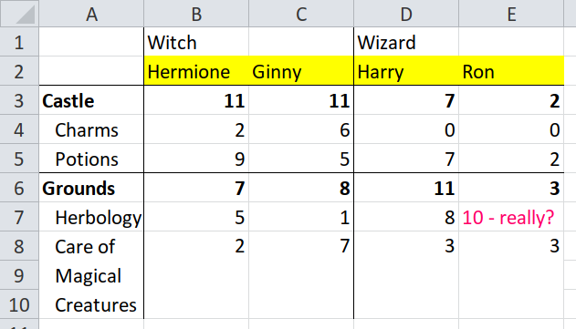
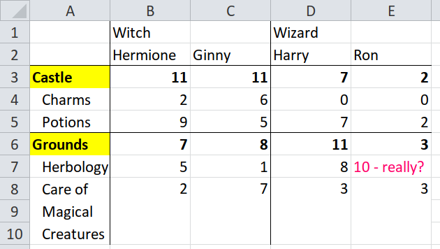
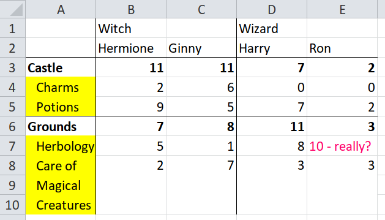

```{r, include = FALSE}
knitr::opts_chunk$set(
  collapse = TRUE,
  comment = "#>"
)
library(here)

# print every row of a data frame
library(knitr)
knit_print.data.frame = function(...) {
  print(..., n = Inf)
}
# register the method
registerS3method("knit_print", "data.frame", knit_print.data.frame)
```

## Preface

This is based on a talk.  You might want to watch the video or read the
[slides](https://docs.google.com/presentation/d/1tVwn_-QVGZTflnF9APiPACNvyAKqujdl6JmxmrdDjok)
(see speaker notes by clicking the cog):

https://docs.google.com/presentation/d/1tVwn_-QVGZTflnF9APiPACNvyAKqujdl6JmxmrdDjok

## 1. Reading easy spreadsheets with {readxl}

It is easy to read a spreadsheet into R when it has:

* A rectangular shape
* One row of column headers
* No meaningful colour or other formatting
* Consistent data types in each column, e.g. all numbers or all text

Here is an example, a dataset of student test marks in different subjects.

```{r image-tidy, echo = FALSE}
knitr::include_graphics(here("vignettes/images/hp-tidy.png"))
```

To test whether a table will be easy to import, ask yourself "Is every row
self-sufficient? Could I read only one row and understand all the data in it?"
In this case, one row will tell you that Ron got two marks in potions in his
second year.

Because this table is simple -- or 'tidy' -- it is easily imported into a data
frame, using the {readxl} package.

```{r tidy-readxl}
library(readxl) # for read_excel()
library(devtools)
load_all()

hp_xlsx <- unpivotr_example("harry-potter.xlsx")

tidy <- read_excel(hp_xlsx, sheet = "tidy")

tidy
```

Note that the row of column names in the spreadsheet has been used as column
names of the data frame.  Also the data type of each column is either `dbl`
(double, which means a number), or `chr` (character) as appropriate.

## 2. Trying to read a hard spreadsheet with {readxl}

Here's is the same data but this time it is in a spreadsheet that the {readxl}
package can't read so easily.  Why not?

```{r image-untidy, echo = FALSE}
knitr::include_graphics(here("vignettes/images/hp-untidy.png"))
```

The `Pupil` and `Year` columns have been combined into one, so the names of the
pupils aren't in the same rows as their marks, nor are they in the same
columns.  There is also a text value `"10 - really?"` amongst a column of
numbers.

Is every row self-sufficient?  Could you read only one row and understand all
the data in it?  No, because one row will only tell you the mark, subject and
year, but not the name.  Or else it will tell you the name, but not the mark,
subject or year.

Here is what happens when the table is read with the {readxl} package.

```{r untidy-readxl}
untidy <- read_excel(hp_xlsx, sheet = "untidy")

untidy
```

What has gone wrong?  The spreadsheet has broken the assumptions that the
{readxl} package makes about data.

* A rectangular shape.  The spreadsheet is not rectangular because the top-left
  cell is deliberately blank (is not 'missing' data), and so are the cells to
  the right of `"Ron"` and `"Ginny"`.
* No meaningful colour or other formatting.  The spreadsheet has meaningful
  formatting to distinguish between names in bold (`"Ron"`, `"Ginny"`) and
  years in plain type, (`"1st year"`, `"2nd year"`).
* Consistent data types in each column.  The spreadsheet has mixed data types in
  the Herbology column, where some cells are numbers and one is text: `"10 -
  really?"`.

The `readxl` package has done its best with a difficult file.

* It has dealt with the non-rectangular shape by filling the gaps, using `...1`
  to fill the cell in the top-left corner with a column header, and `NA` to fill
  the cells to the right of `Ron` and `Ginny`.
* It has dealt with the mixed data types in the Herbology column by treating
  everything as text, even the numbers, so that it can accommodate the text
  value `"10 - really?"`.
* It hasn't dealt with the meaningful formatting (bold names) because it is
  blind to formatting -- {readxl} doesn't know anything about formatting except
  for data types.

Unfortunately {readxl} hasn't been able to make the data tidy.  Each row still
isn't self-sufficient.  You couldn't read only one row and understand all the
data in it.

Here is a final example of a spreadsheet that breaks the one remaining
assumption: that there is a single row of column headers.  This file has two
rows of column headers.

```{r image-untidy2, echo = FALSE}
knitr::include_graphics(here("vignettes/images/hp-pivoted.png"))
```

The rest of this tutorial will demonstrate how to use the {tidyxl} and
{unpivotr} packages to import that spreadsheet.

## 3. Demonstration of {tidyxl} and {unpivotr}

Don't expect to understand yet how the following code works.  It is here to show
you what to expect later, and it is the entire code to import the spreadsheet
above.

```{r tidyxl-unpivotr-demo}
library(dplyr)
library(tidyr)
library(tidyxl)
library(unpivotr)

hp_xlsx <- system.file("extdata/harry-potter.xlsx", package = "unpivotr")

cells <- xlsx_cells(hp_xlsx, sheet = "pivoted")
formats <- xlsx_formats(hp_xlsx)

indent <- formats$local$alignment$indent

tidied <-
  cells %>%
  dplyr::filter(!is_blank) %>%
  behead("up-left", "dormitory") %>%
  behead("up", "name") %>%
  behead_if(indent[local_format_id] == 0,
            direction = "left-up",
            name = "location") %>%
  behead("left", "subject") %>%
  select(address, dormitory, name, location, subject, mark = numeric) %>%
  arrange(dormitory, name, location, subject)

tidied
```

## 4. Explanation of tidyxl::xlsx_cells()

The first step to import a difficult spreadsheet is to read it with
`tidyxl::xlsx_cells()`.

What does `tidyxl::xlsx_cells()` do that is different from
`readxl::read_excel()`?  Instead of returning the *data* in a data frame, it
returns *individual cells* in a data frame.  Try matching each row of the output
of `xlsx_cells()` to a cell in the spreadsheet.

```{r xlsx_cells}
cells <-
  xlsx_cells(hp_xlsx, sheet = "pivoted") %>%
  # Drop some columns to make it clearer what is going on
  select(row, col, is_blank, data_type, character, numeric, local_format_id)

cells
```

The first row of the output describes the cell B2 (row 1, column 2) of the
spreadsheet, with the character value `"Witch"`.

```
# A tibble: 47 x 7
     row   col is_blank data_type character numeric local_format_id
   <int> <int> <lgl>    <chr>     <chr>       <dbl>           <int>
 1     1     2 FALSE    character Witch          NA               2
```

Row 10 describes the cell C3 (row 3, column 3) of the spreadsheet, with the
numeric value `11`.

So what `xlsx_cells()` has done is give you a data frame that isn't data itself,
but it *describes* the data in the spreadsheet.  Each row describes one cell.
This allows you to do some fancy tricks, like filter for all the numeric cells.

```{r filter-numeric}
cells %>%
  dplyr::filter(data_type == "numeric")
```

Or you could filter for a particular cell by its row and column position.

```{r filter-position}
cells %>%
  dplyr::filter(row == 2, col == 4)
```

And you can filter out all 'blank' cells.  A cell is 'blank' if it has
formatting but no value.  Sometimes it's useful to have these, but usually you
should discard them.

```{r filter-blank}
cells %>%
  dplyr::filter(!is_blank)
```


That is all you need to know about the tidyxl package for now.  Later you will
be shown how to filter for cells by their formatting (e.g. bold cells, indented
cells, or cells with coloured text).

## 5. Explanation of unpivotr::behead()

You've seen that `tidyxl::xlsx_cells()` reads a spreadsheet one cell at a time,
so that you can filter for particular cells by their position, their value,
their data type, etc.  You could now write code to tidy up any spreadsheet.

The unpivotr package gives you some pre-packaged tools for tidying up a
spreadsheet.  The most important tool is `behead()`, which deals with one layer
of header cells at a time.

Let's look again at the original spreadsheet.  I have highlighted the first row
of header cells.

```{r image-untidy-header-row-1, echo = FALSE}
knitr::include_graphics(here("vignettes/images/untidy-header-row-1.png"))
```

Use `unpivotr::behead()` to tag data cells with `"Witch"` or `"Wizard"`,
and then strip (or behead!) those header cells from the rest -- they are no
longer required.

```{r behead-row-1}
cells %>%
  dplyr::filter(!is_blank) %>%
  behead("up-left", "dormitory")
```

Click through table to check that every cell belonging to the Witch header has
been taggged `"Witch"` in the column `dormitory`, and the same for wizards  Notice
that the locations `Castle` and `Grounds` have also been tagged witch or wizard.
Also, all the cells in row 1 have disappeared -- they have become values in the
`dormitory` column.

What do the arguments to `behead("up-left", "dormitory")` mean?  The second one,
`"dormitory"` becomes the column name of the male/female tags.  But the direction
`"up-left"` is the most important one.  It tells `behead()` which way to look
for a header cell.

For example, starting from the cell C3 (row 3 column 3), `behead()` looks
up and to the left to find the header `"Witch"`.  Starting from
the cell D4 (row 4, column 4) it finds the header `"Wizard"`.  Starting from cells in
the first column, there is no header cell in the `"up-left"` direction, so they
are tagged with missing values.  Don't worry about them -- they will come right
later.

What if we try a different direction instead, `"up-right"` (up and to the
right)?  Again, compare the table with the spreadsheet

```{r image-untidy-header-row-1-2, echo = FALSE}
knitr::include_graphics(here("vignettes/images/untidy-header-row-1.png"))
```

```{r up-right}
cells %>%
  dplyr::filter(!is_blank) %>%
  behead("up-right", "dormitory")
```

Check that Ginny has been tagged `"Wizard"`, and so have her marks in cells
below.  Unpivotr doesn't know that this is wrong, it has just done what it was
told.  The `behead()` function isn't magic, it just enables you to tell unpivotr
which data cells relate to which header cells.

## 6. Continuing `unpivotr::behead()`

Let's carry on with the second row of header cells (highlighted).  This time the
direction is simply `"up"` for directly up because there is a header in every
column.  Notice that we're building up a pipeline of transformations, one set of
headers at a time.

```{r image-untidy-header-row-2, echo = FALSE}

```

```{r}
cells %>%
  dplyr::filter(!is_blank) %>%
  behead("up-left", "dormitory") %>%
  behead("up", "name")
```

Click through the table to match it to the spreadsheet.  The header cells in
rows 1 and 2 have all disappeared to become values in the `dormitory` and `name`
columns.  The cell C3 (row 3, column 3) has been tagged `"Witch"` and
`"Ginny"`

## 7. Handling meaningful formatting with `unpivotr::behead_if()`

Applying the same procedure to the headers in column A, which describe
the location and subject, what are the directions?

Starting from a data cell, say, B7 (row 7, column 2), the location is` "Grounds"`,
which is to the left and then up, `"left-up"`.

```{r image-untidy-header-col-1, echo = FALSE}

```

But there is a complication.  When `unpivotr::behead()` is travelling up the
cells in column 1, how does it know to stop at `"Grounds"` and not overshoot to
`"Potions"` or any of the cells further up?  You must tell `behead()` to stop at
the first cell that isn't indented.  Alternatively, you could tell it to stop at
the first cell that is bold.

Use `unpivotr::behead_if()` when there is a rule to identify a header cell.  In
this case the rule will be "when the cell has bold formatting".

A spreadsheet cell can have so many different formats that it would be unweildy
for {tidyxl} to import them all at once.  Instead, {tidyxl} imports a kind of
lookup table of formatting, and each cell has a key into the lookup table,
called `local_format_id`.

Here's how to look up the `indented` property of a cell.

```{r indented}
formats <- xlsx_formats(hp_xlsx) # load the format lookup table from the file

indent <- formats$local$alignment$indent # find the 'indent' property

indent[cells$local_format_id] # look up the indent property of each cell
```

When you look up a format from inside `behead_if()`, you don't need to mention
`cell$`, but you do have to name the other arguments to `behead()`.

```{r indented-behead-if}
formats <- xlsx_formats(hp_xlsx) # load the format lookup table from the file
indent <- formats$local$alignment$indent # find the 'indent' property

cells %>%
  dplyr::filter(!is_blank) %>%
  behead("up-left", "dormitory") %>%
  behead("up", "name") %>%
  behead_if(indent[local_format_id] == 0,
            direction = "left-up", # This argument has to be named now.
            name = "location")     # So does this one.
```

You can give more than one rule to `behead_if()` at once.  They are applied
together, so all the rules must evaluate to `TRUE` for a cell to be treated as a
header cell.  Here's an example applying the additional rule that a cell must be
bold.  The result in this case is the same.

```{r indented-bold-behead-if}
formats <- xlsx_formats(hp_xlsx)
indent <- formats$local$alignment$indent
bold <- formats$local$font$bold # find the 'bold' property

cells %>%
  dplyr::filter(!is_blank) %>%
  behead("up-left", "dormitory") %>%
  behead("up", "name") %>%
  behead_if(indent[local_format_id] == 0, # First rule
            bold[local_format_id],        # Second rule. Both must be TRUE
            direction = "left-up",
            name = "location")
```

Check that Hermione got 5 marks in a subject taken in Hogwarts grounds, by
looking at cell B7 (row 7, column 2).

## 8. Finishing and cleaning up

Only one layer of headers remains: the subjects in column 1.  The direction is
directly `"left"`.

```{r image-untidy-header-col-2, echo = FALSE}

```

```{r}
cells %>%
  dplyr::filter(!is_blank) %>%
  behead("up-left", "dormitory") %>%
  behead("up", "name") %>%
  behead_if(indent[local_format_id] == 0,
            direction = "left-up",
            name = "location") %>%
  behead("left", "subject")
```

Check that Hermione got 5 marks in Herbology in particular, taken in Hogwarts
grounds, by looking at cell B7 (row 7, column 2).

The final cleanup is straightforward; choose the columns to keep, using the
standard tidyverse function `dplyr::select()`.  At the same time you can rename
the column `numeric` to `mark`, and the column `character` to `other`.  What is
the column `other` for?  For the value `"10 - really?"`.

```{r cleanup}
cells %>%
  dplyr::filter(!is_blank) %>%
  behead("up-left", "dormitory") %>%
  behead("up", "name") %>%
  behead_if(indent[local_format_id] == 0,
            direction = "left-up",
            name = "location") %>%
  behead("left", "subject") %>%
  select(dormitory, name, location, subject, mark = numeric, other = character)
```

It is up to you now what to do with the 'total' values for the castle and the
grounds.  If you don't want to keep them, it's easy enough to filter them out
using `!is.na(subject)`.  That is done in the final code listing below.

```{r final}
library(dplyr)
library(tidyr)
library(tidyxl)
library(unpivotr)

hp_xlsx <- system.file("extdata/harry-potter.xlsx", package = "unpivotr")

cells <- xlsx_cells(hp_xlsx, sheet = "pivoted")
formats <- xlsx_formats(hp_xlsx)

indent <- formats$local$alignment$indent

tidied <-
  cells %>%
  dplyr::filter(!is_blank) %>%
  behead("up-left", "dormitory") %>%
  behead("up", "name") %>%
  behead_if(indent[local_format_id] == 0,
            direction = "left-up",
            name = "location") %>%
  behead("left", "subject") %>%
  select(address, dormitory, name, location, subject, mark = numeric) %>%
  arrange(dormitory, name, location, subject)

tidied
```

## Review

Well done for making it this far.  If you have struggled to follow, that is
normal -- it means you are learning.  Try reading through a second or third
time, and change parts of the code to see what happens.
